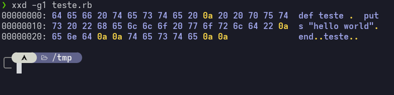
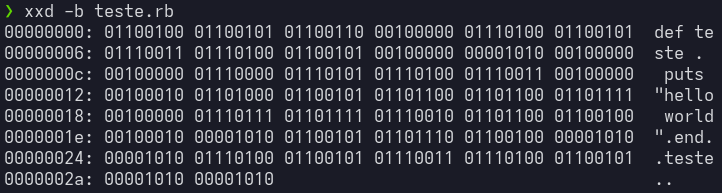

Nesse post irei abordar o seguinte questionamento:

>"Eu preciso realmente aprender baixo nivel?"

E esse questionamento geralmente vem com argumentos como: "No dia-dia baixo nivel nem é usado" ou "linguagens como C ou assembly não é usado pelas empresas e olha só, nem estão aquecidas no mercado".

Porém essa pergunta é fácil de responder, um motorista precisa aprender mecânica? a resposta é não. Mas isso tornaria ele melhor e diferente no que faz? aí a resposta muda completamente... Os argumentos não estão errados, porém, negligenciar sua carreira toda por desculpas tão esfarrapadas e preguiçosas é loucura.

No mesmo sentido em que o motorista possa ser o melhor piloto do mundo, se o carro quebrar quem ele chama? um mecânico. Agora o programador pode ser o melhor especialista em linguagem de programação X do mundo, se o sistema remoto da empresa der pau, quem ele chama? a mãe? o chefe, que vai descobrir sua incompetência? o time de produto e marketing que não faz a mínima ideia do que ele está falando? ou o outro programador que vai saber resolver esse problema, e logo vai ganhar mais destaque e aumento? Esse cenário pode parecer fictício mas pode ocorrer em empresas pequenas, que apenas contém 1 programador ou um time de 3 ou 4 no máximo, essas empresas são a base da escada, é o primeiro emprego de todo programador iniciante, Em empresas grandes existem profissionais especializados nisso, chamados de DevOps, mas essa não é a realidade de muitos ambientes de trabalho.

>O verdadeiro prejuízo está na capacidade de resolver problemas e de criar soluções próprias. 

# Como o Campo de Visão e Estudo se Abre

Quando digo "especialista em linguagem X" como Python, Javascript, Ruby ou até Java, não quero dizer que ele seja bom especificamente por isso, até uma criança pode digitar código, uma IA consegue, sua tia consegue, uma Linguagem de Programação é útil mas é apenas uma ferramenta, é um jeito de enviar instruções a um computador e ponto. 

Um programador que fica apenas digitando código de [alto nível](https://www.dio.me/articles/linguagens-de-programacao-de-alto-e-baixo-nivel), ficando apenas no básico e não sabe de coisas mais chatas matemática e lógica está limitando a sua carreira. Por que se limitar tão cedo estando no início dela?

Lógica de programação é necessária mas não chega nem a ser o básico do básico, é apenas o essencial. 

>É como aprender a ler sem saber escrever. Não funciona.

Por isso não incentivo o uso da PseudoLinguagem como o [Portugol](https://pt.wikipedia.org/wiki/Portugol) aprender lógica é trivial, e não faz sentido dar a um iniciante uma ferramenta que é apenas para isso, e que pode acostumá-lo com vícios como os de [Más Práticas de Programação](https://pt.wikipedia.org/wiki/Boas_pr%C3%A1ticas_de_programa%C3%A7%C3%A3o), já que não é uma linguagem de verdade, pode ser considerada uma perda de tempo completa.

Salvo engano apenas as pessoas que realmente têm uma Dificuldade em raciocínio e lógica, para isso o Portugol pode ser um ótimo ponto de partida.

O simples fato de estudar [Linguagens de baixo nível](https://minutodaseguranca.blog.br/importancia-da-linguem-de-programacao-de-baixo-nivel/), é para ajudar no desenvolvimento da capacidade cognitiva e na melhoria expressiva da qualidade do código feito. Ajudar o desenvolvedor a ter um outro campo de visão a pensar fora da caixa. Um programador que fica apenas no superficial não tem segurança e otimização, não tem noção de que o Python ou o Javascript dele esteja consumindo 150% a mais do que deveria de memória e performance, coisas que em [Escalabilidade Vertical](https://aerospike.com/blog/vertical-vs-horizontal-scaling/) de um [Deploy](https://olavodotpy.github.io/posts/2024/12/17/colocando-em-producao-um-projeto-django-fazendo-deploy-no-railway/) custa dinheiro e pode dar prejuízo em dívidas.

>Em um sistema mais complexo você é obrigado a pensar em uma coisa muito chata chamada de Escalabilidade, recurso não é infinito é finito e custa $.

# Como Um Simples "Hello world" Vira Algo Mais Complicado

Um exemplo: vamos criar um arquivo de qualquer linguagem mesmo, mas primeiro vamos para a pasta temporária do Linux para não poluir os diretórios: ```cd /tmp``` onde o comando `cd` significa: Change Directory.

Uma vez lá dentro vamos "tocar" ou criar um arquivo: `touch teste.rb` e vamos abrir e uma IDE ou um editor via CLI que significa interface em linha de comando, aqui vou utilizar o VIM, `vim teste.rb`. 

vou agora escrever uma função trivial em Ruby de "hello world".

```ruby

def teste
    puts "hello world"
end

teste
```

Para uma pessoa que apenas ficou no superficial isso basta, é realmente algo super simples, porém sua visão sobre esse código continua limitada por mais simples que ele seja.

Agora salvamos e saímos com `:wq!` uma vez fora do editor e dentro do nosso diretório, executaremos `xxd -g1 arquivo` com a saída disso, temos algo mais complexo. 



Uma mudança radical no campo de visão do programador, agora é o mesmo código mas representado em [Hexadecimal](https://pt.wikipedia.org/wiki/Sistema_de_numera%C3%A7%C3%A3o_hexadecimal), o mais próximo de como seria em uma [escovação de bit](https://pt.stackoverflow.com/questions/92755/de-onde-vem-a-express%C3%A3o-escovar-bits-e-qual-o-equivalente-em-ingl%C3%AAs). Na esquerda contendo o Offset em Bytes, ou seja a posição em Bytes do conteúdo do arquivo, de 0...0 até 0...10 é 16 Bytes, em exa 16 = 10.

Na direita as letras são representadas também em Hexadecimal, se observar bem, veremos o  conteúdo original do arquivo: 65 em exa é a letra "e" no meu código, tendo cada caractere 1 Byte. 

Agora executando `xxd -b arquivo` veremos tudo em Binário. 



Tendo cada caractere representado por um Byte, cada Byte contendo 8 Bits. 

Essa série de comandos que exemplifiquei é uma forma de enxergar o código bem simples mas com outros olhos, não em uma camada tão superficial como apenas a sintaxe funcional e o resto "mágica", mas sim que a sintaxe vira caracteres, encode, bytes e bits. 

Não se empolgue, isso **mal** é a Pré-introdução de Programação de baixo nível.